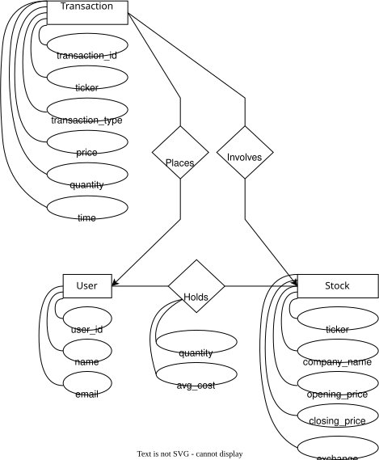

# Entity-Relationship Diagram

The diagram below models the `stock_trading` database, covering users, stocks, their trading transactions, and current holdings.

## Entities

- **User** — a trading account, identified by `user_id`.
- **Stock** — a tradable security, identified by `ticker`, with pricing and exchange info.
- **Transaction** — a single buy/sell order, linking a `User` to a `Stock`.

## Relationships

- **Places** (User 1 : N Transaction) — a user can place many transactions.
- **Involves** (Stock 1 : N Transaction) — a stock can be involved in many transactions.
- **Holds** (User M : N Stock) — a many-to-many relationship tracking each user's current position (`quantity`, `average_price`) in a stock.

See [`sql/ddl.sql`](../sql/ddl.sql) for the corresponding table definitions.
